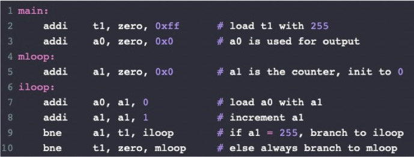
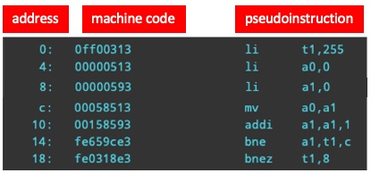
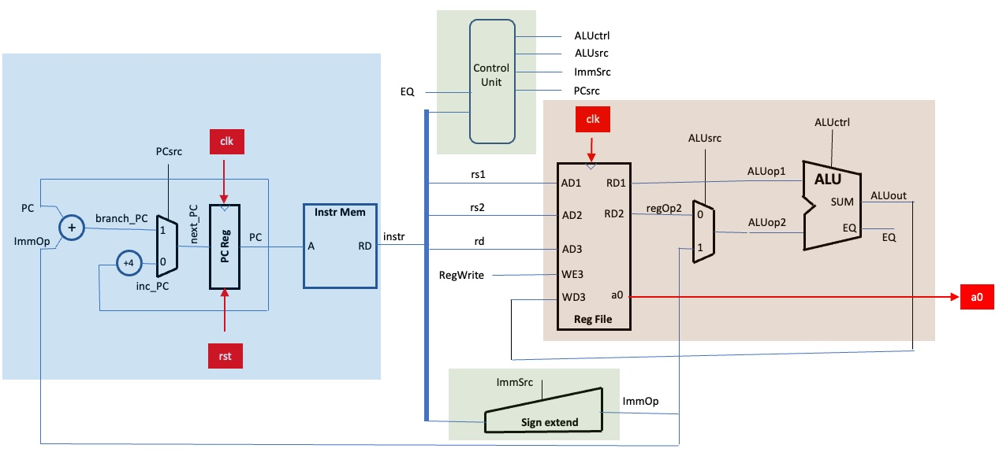

<center>

## EIE2 Instruction Set Architecture & Compiler (IAC)

---
## Lab 4 - A Reduced RISC-V CPU

**_Peter Cheung, V1.0 - 16 Nov 2022_**

---

</center>

## Objectives
By the end of this experiment, you should be able to:
* Form a Team of four members and get to know each other
* As a team, create a Team Github repo with its initial structure
* Each member learned how to pull and push from the repo
* Each member understand the tasks required for Lab 4 as a Team
* Allocate responsibility for each member according to the task partitioning given to you in this instruction
* Complete the design of the Reduced RISC-V to execute the program provided
  
<br>

___

## Know your team members
___

Working as a team with people you don't know is a challenge. It is often much easier to work on your own.  You are required to work as a team because:
1. The coursework for this module is too large for one person to complete.
2. You learn much more from each other provided that the "stronger" student is prepare to teach the "weaker" student - both will benefit, and those in need of help willing to admit and ask.
3. Github was created mainly to provide a collaboration tool.  You will be force to learn and use Git and Github, which is part of the education goal of this module.
4. It may improve your social skills.
   
>Introduce yourself to each other by doing a 5 minutes each one-on-one chat. This will take only 15 minutes, but it is important to do this a this stage.

<br>

___

## Set up Github Repository for the Team

___


>Choose among the Team a Repo Master, who is reponsible create the repo and  make sure that all other team member learn how to do it themselves if needed. All member should also learn how to branch, pull, push and commit to the repo.  Discuss among yourself an initial structure of the repo and a set of common practices that your Team should follow. 

You can find a very helpful guide on how to set up your repo in Github [here](https://docs.github.com/en/get-started/quickstart/create-a-repo "How to create a repo").

___

<p align="center">FINAL TEAM PROJECT ASSESSMENT WILL INCLUDE A CHECK ON HOW OFTEN  </p>
<p align="center">YOU COMMIT TO THE  REPO AS EVIDENCE OF AN INDIVIDUAL'S CONTRIBUTION. </p>

<br>

___

## The Reduced RISC-V Specification

___

Your team task for Lab 4 is to design a *__SINGLE CYCLE__* CPU that executes two (or three) RISC-V instructions.  To verify that your design works, the CPU should execute the simple assembly language program below: <br><br>

<p align="center">  </p> <br>

This program performs the same function as the simple 8-bit binary counter you design in Lab 1 (i.e. counter.sv).  Note that this uses ONLY two instructions: "addi" and "bne". It demonstrates how "reduced" the RISC-V ISA is!  However, this also makes the assembly program hard to read and understand. One can translate these instructions to pseudoinstructions, which make the program much easier to read. (I used the online assembler [here](https://riscvasm.lucasteske.dev/).). The equivalent asssembly code with pseudoinstruction is:

<p align="center">  </p><BR>

> Each student should take one addi and one bne instruction, and check you fully understand why the instruction is map to this machine code.  (See Lecture 6 slide 7.)

<br>

___

## The Microarchitecture of the Reduced RISC-V CPU

___

To help you progress quickly, here is the top-level block diagram for this CPU.  Note the following:
1. This is a *__single cycle__* design meaning that on each rising edge of the clock, one instruction is executed.
2. The program memory must be asynchronous - meaning that as soon as the Program Counter (PC) changes, the instruction will appear at the program memory output.  You should modify Lab 2 memory block (you may use RAM or ROM here) so that it is asynchronous.  You can preload the memory with the machine code program from a file.
3. Only two components here are clocked: the PC Register that maintains the program counter and the Register File.  The two READ ports of the register file should also be asychronous and the WRITE port of the Register File must be synchronous.
4. The thick verticle blue bar shows how the 32-bit instructions is split into fields to drive the different modules. It is NOT a component.
5. The entire CPU only has three I/O ports shown in RED: clock signal _clk_, _rst_ and the contents of the a0 register (directly from the Register File). This allows us to bring this register content to the outside directly.
6. The Sign-extension Unit takes the relevant fields from the instruction and composes the immediate operand depending on the instruction.
7. The Control Unit is not clocked and decodes the instruction to provide control signals to various modules.
<br><br>

<p align="center">  </p><br>

>Discuss among yourselves why the WRITE port of the Register File must be synchrous to the clock signal.

___

## How to divide the job into individual components

___

In team project, there is always a danger that a team member is too keen and able, and wanting so much the team to succeed that they "hog" the project and do everything.  Or a team member is trying to do as little as possible and just be a passenger.  Therefore, the task in this Lab is divided into four separate components as shaded blocks, one for each team member as followings:
1. Program Counter and related adders, and the instruction memory.
2. The Register File, ALU and the related MUX.
3. The Control Unit and the Sign-extension Unit.
4. The testbench and verification of the design working via gtkWave and Vbuddy (where appropriate).

>Discuss and agree among yourselves who does what.  
>Complete the Lab 4 Team's Survey [here](https://forms.office.com/r/n2zeXxxvaJ "Survey").  Only ONE survey per team.

<br>

___

## Define interface of all modules

___

>Each member should define the interface signals of the modules for which they are responsible. The test person should create a test plan. 
<br>

Please use the signal names as shown in the block diagram. This allows TAs and myself to help you debug your design easier without having discover your naming convention.

<br>

___

## Stretched Goal

___

>If your team has time, you can modify your design to include the "lw" instruction.  You then need to change the microarchitecture to add a block of data memory (separate from program memory), into which you store a single cycle of sine coefficents. Replace line 7 of the program with:

```brainfuck
      lw    a0, 0(a1)
```

This is  the implementation of the Lab 2 sinewave generator using RISC-V instructions!

<br><br>

___

## Deliverables

___

Note that Lab 4 is designed to be a formative assessment exercise.  The deliverables here are designed to help you learn and to self-assess how you and your team is doing.  We will also provide informal feedback to you during Lab Sessions.  This will NOT contribute towards the final coursework marks.

>On the repo for your team, you should have:
>1. A README.md that show evidences of the CPU working properly with the program.
>2. A short narrative to state the challenges you encountered as a team. 
>3. Comments about any design decisions you made that are not obvious and reasons why.
>4. A reflection on what you might do differently if you were to start again.
